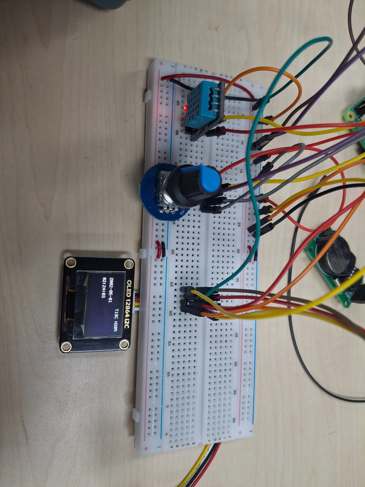
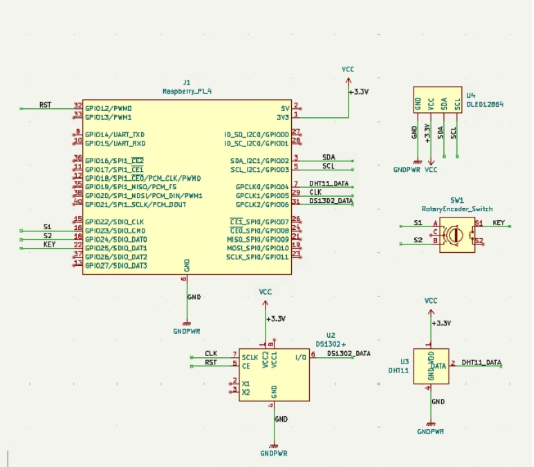
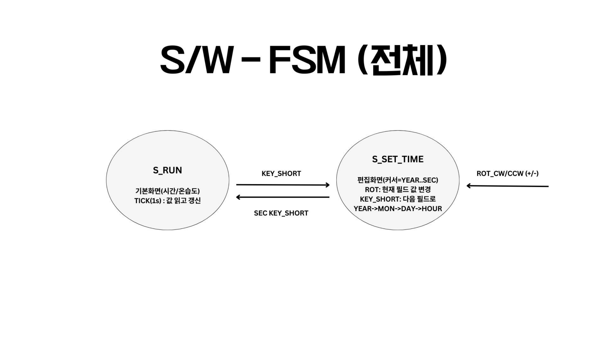
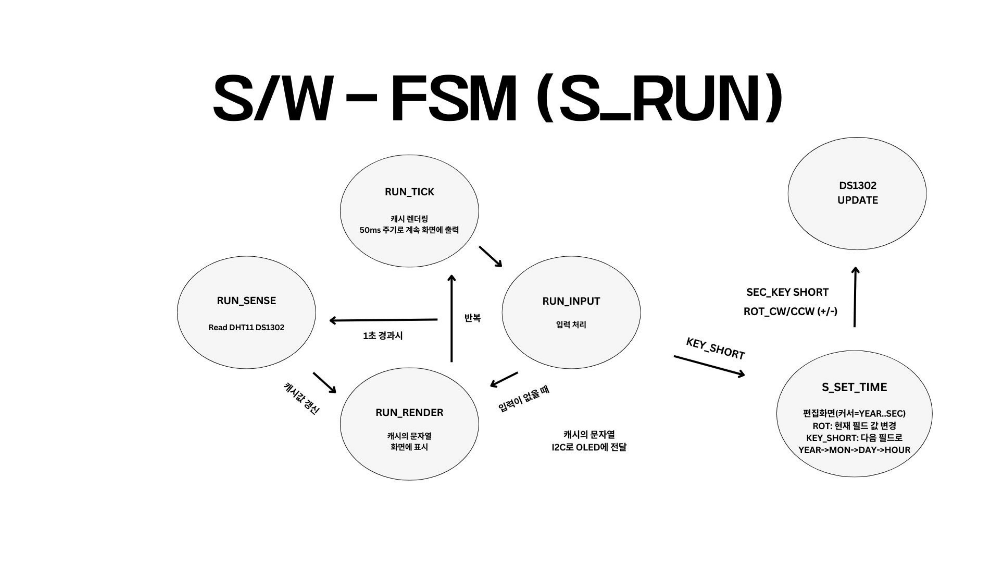

# Project-DeviceDriver

> Raspberry Pi 4에서 **SSD1306 OLED + DS1302 RTC + DHT11 + Rotary Encoder**를 **Linux Kernel Module**로 직접 제어하고,  
> 커널 내부 **상태머신(UI)** 로 “시간/온습도 표시 + 시간 설정” 기능을 구현한 프로젝트입니다.

<p align="center">
  
</p>

---

## 주요 기능

- **RUN 모드**: DS1302(시간) + DHT11(온습도) 값을 읽어 OLED에 주기적으로 표시  
- **SET TIME 모드**: 버튼으로 진입 → 로터리로 값 증감 → 버튼으로 필드 이동 → 저장 후 RUN 복귀
- **커널 레벨 입력/스케줄링**
  - 로터리 인코더 GPIO **IRQ 기반** 입력 처리(방향 판별)
  - 주기 작업(**workqueue / delayed_work**) 기반 화면 갱신 & 센서 폴링
- **정밀 타이밍 프로토콜 처리**
  - DHT11의 µs 단위 프로토콜을 `udelay()` + timeout + 체크섬으로 안정적으로 수신
  - 타이밍 안정화를 위해 필요한 구간에서 **preemption/IRQ 제어** 적용

---

## 하드웨어 구성

### BOM

| 부품                    | 인터페이스/신호                         | 역할                  | 비고                   |
| --------------------- | -------------------------------- | ------------------- | -------------------- |
| Raspberry Pi 4        | GPIO / Linux                     | 호스트(드라이버/애플리케이션 실행) | 3.3V GPIO 사용         |
| SSD1306 OLED (128×64) | I2C (SDA/SCL)                    | 상태/정보 표시            | I2C 주소(보통 0x3C/0x3D) |
| DS1302 RTC 모듈         | 3-wire (CE/RST, SCLK, I/O) + 배터리 | 시간 유지/타임스탬프         | 배터리로 전원 유지           |
| DHT11 온습도 센서          | 1-wire Data                      | 온/습도 측정             | 샘플링 간격 제한 있음         |
| 로터리 인코더               | A/B(2상) + Push 버튼                | 사용자 입력              | 인터럽트/폴링 방식 가능        |


### 회로도 / 배선

<p align="center">
  
</p>

| Device | Signal | RPi (BCM) | RPi (Physical) | 비고 |
|:---:|:---:|:---:|:---:|:---:|
| OLED(SSD1306) | SDA | GPIO2 | 3 | I2C1 |
|  | SCL | GPIO3 | 5 | I2C1 |
|  | VCC | 5V(또는 3V3) | 2(또는 1) | 모듈 스펙에 맞게 |
| DHT11 | DATA | GPIO4 | 7 | 필요 시 Pull-up 확인 |
|  | VCC | 3V3 | 1 |  |
| DS1302 | CE/RST | GPIO12 | 32 | 3-wire |
|  | SCLK | GPIO5 | 29 | 3-wire |
|  | I/O | GPIO6 | 31 | 3-wire |
|  | VCC | 3V3 | 1 | 배터리 포함 모듈 사용 |
| Rotary | S1(A) | GPIO22 | 15 | 2상 |
|  | S2(B) | GPIO23 | 16 | 2상 |
|  | KEY | GPIO24 | 18 | Push 버튼 |

> (보드나 배선 변경 시, 소스의 핀 매핑만 교체)

---

## 소프트웨어 아키텍처

### 상태 머신(UI)

<p align="center">
  
</p>

- **S_RUN**
  - 일정 주기(예: 50ms)로 화면 렌더링
  - 일정 주기(예: 1s)로 DS1302/DHT11 센싱
- **S_SET_TIME**
  - 버튼: 설정 필드 이동(Year → Month → Day → Hour → Min → Sec → Save)
  - 로터리: 선택 필드 값 증감(CW/CCW)

### RUN 루프(커널 내부 작업 흐름)

<p align="center">
  
</p>

- **workqueue/delayed_work** 기반 tick에서
  - 입력 이벤트 확인(로터리/키)
  - 센서 값 갱신(주기 분리)
  - OLED 버퍼/문자열 캐시 구성 후 출력

---

## 빌드 & 실행

### 0) 준비물
- Raspberry Pi OS / Debian 계열
- 커널 헤더 & 빌드 툴체인

```bash
sudo apt update
sudo apt install -y build-essential raspberrypi-kernel-headers
```

### 1) I2C 활성화(OLED)
```bash
sudo raspi-config
# Interface Options -> I2C -> Enable
sudo reboot
```

(선택) I2C 디바이스 탐지
```bash
sudo apt install -y i2c-tools
i2cdetect -y 1
# 보통 0x3c 또는 0x3d가 보입니다.
```

### 2) 커널 모듈 빌드
```bash
cd Driver_source
make
ls -l *.ko
```

### 3) 모듈 로드/언로드
> 실제 `.ko` 이름은 `Driver_source` 빌드 결과에 맞춰 로드하세요.

```bash
sudo insmod <module>.ko
dmesg -w
```

언로드:
```bash
sudo rmmod <module>
```

---

## 구현 포인트

- **DHT11 bit-banging 수신 로직**
  - µs 단위 시퀀스(응답/비트 구간)를 timeout 기반으로 보호
  - 체크섬 검증으로 데이터 무결성 확보
  - 필요 구간에서 `preempt_disable()` / `local_irq_save()`로 타이밍 안정화

- **Rotary Encoder 인터럽트 처리**
  - GPIO IRQ에서 A/B 위상으로 방향(CW/CCW) 판별
  - 이벤트를 커널 내부 큐/상태로 전달하고, 소비 측을 `wait_queue`로 깨움
  - 동시성 보호(`spin_lock_irqsave`)로 이벤트 유실 방지

- **OLED 렌더링 파이프라인**
  - 문자열/프레임 캐싱 후 일정 주기마다 I2C로 송신
  - RUN/SET 모드에 따라 UI 표시(선택 필드 강조 등)

---

## 폴더 구조

```text
Project-DeviceDriver/
├─ Drive_HW/                 # 하드웨어 사진/회로도(권장: images/)
│  └─ images/
├─ Driver_source/            # 커널 모듈 소스/Makefile
└─ docs/
   └─ Linux커널DeviceDriver.pptx  # 설계/발표 자료
```

---

## 참고 자료
- 발표/설계 자료: `docs/Linux커널DeviceDriver.pptx`

---

## License
- (필요 시 추가)
